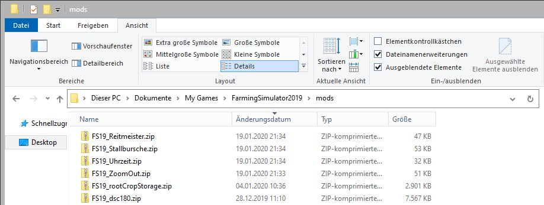
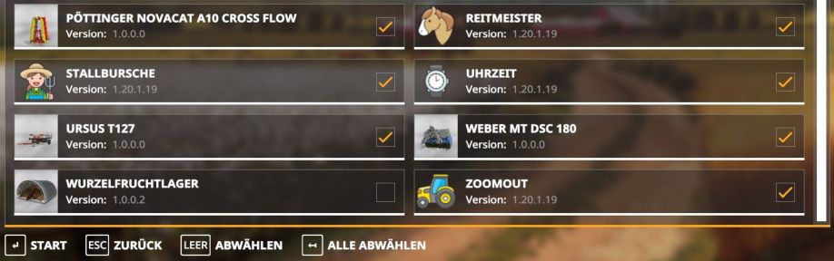

# LS19 MODS
Landwirtschafts-Simulator 19 Mods

[ls19mods on github](https://github.com/omni-trash/ls19mods)

Die Mods müssen in den mods-Ordner vom Farming Simulator 19 abgelegt werden, also unter:

```
C:\Users\<your name>\Documents\My Games\FarmingSimulator2019\mods
```
Das ist der Ordner wo auch die Downloads vom Mod-Hub abgelegt werden.

Hier gibt es jetzt zwei Möglichkeiten:

1. die Datei FS19_modname.zip aus dem dist-Ordner (hier im Repo) dort ablegen. Das ist zum Beispiel für den MultiPlayer-Modus erforderlich (online).
2. den Ordner FS19_modname aus dem dist-Ordner dort ablegen. 

Wenn ihr nicht die Datei sondern den Ordner nehmt, dann könnt ihr dort auch die mod.lua öffnen und nach belieben bearbeiten und anpassen. Das ist eine Textdatei, wo das LUA-Script drin steht.



Eine Dokumentation zum Scripting findet ihr auf [GIANTS Developer Network](https://gdn.giants-software.com/documentation.php), wer sich dafür interessiert.

Denkt daran die Mods zu aktivieren.


