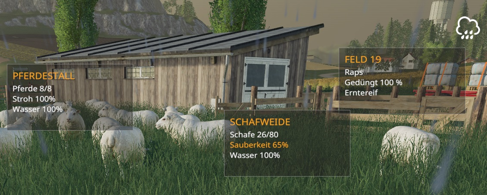

# LS19 Augmented Reality

Version 1.21.5.30

Zeigt Informationen zu Felder und Tierstallungen an.

| Ein/Aus |
| ------- |
| NUM *   |

Weitere Informationen zum Einbinden der Script-Mods unter [ls19mods](../README.md).
