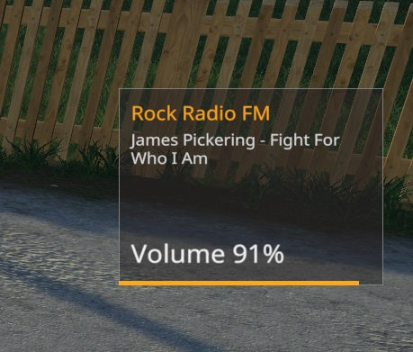

# LS19 Radio Volume

Version 1.21.5.30

Die Lautstärke vom Radio einstellen.

| Lauter | Leiser |
| ------ | ------ |
| NUM +  | NUM -  |

Weitere Informationen zum Einbinden der Script-Mods unter [ls19mods](../README.md).
