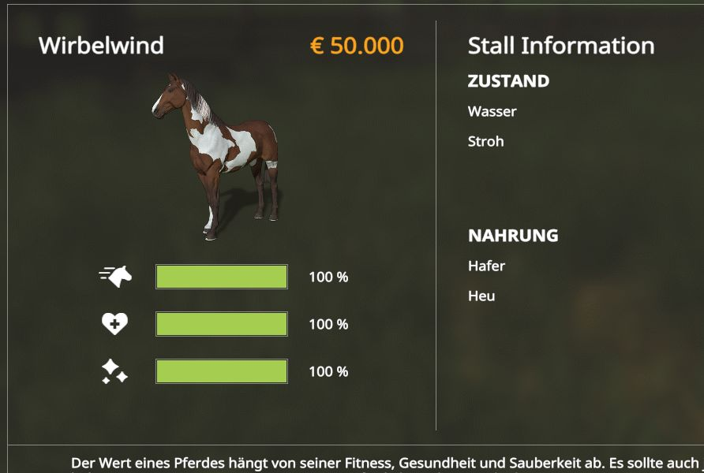

# LS19 Reitmeister

Version 1.20.1.19

Der Reitmeister hilft dir beim Ausreiten deiner Pferde. Wenn du genug Zeit hast, dann kannst du deine Pferde auch selber ausreiten. Jedes Pferd muss einmal am Tag 5 Minuten lang ausgeritten werden, damit seine Fitness steigt, und somit auch der Wert. Das übernimmt nun der Reitmeister automatisch, so alle 30 bis 40 Minuten wird immer ein Pferd geritten. Oben rechts erscheint dann eine Meldung. Es wird kein InGame-Geld abgezogen. Es werden maximal 16 Pferde unterstützt. Wer den Horse Helper Mod schon installiert hat, der braucht dieses Mod nicht.

Und für die Neulinge unter euch, bei 100% hat dein Pferd einen Wert von 50.000 EUR, mehr geht nicht. Dann ist es Zeit für den Verkauf, oder ihr behaltet es einfach so zum Spaß.

Weitere Informationen zum Einbinden der Script-Mods unter [ls19mods](../README.md).
