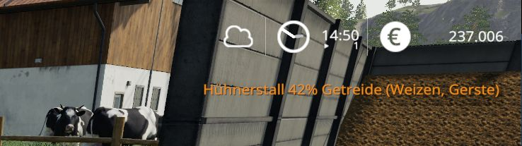
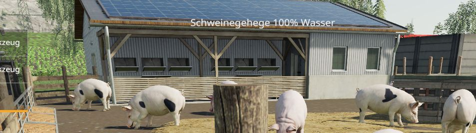
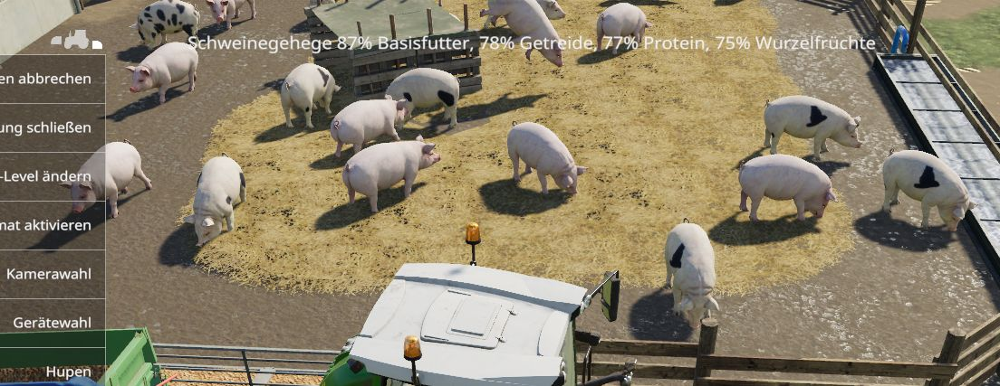

# LS19 Stallbursche

Version 1.20.8.24


Der Stallbursche informiert dich über den Zustand deiner Stallungen. Das bedeutet aktuell die Füllstände von Futter, Wasser, Gülle, Milch und so weiter. Nicht angezeigt werden die Füllstände der Getreide-Silos. Hier geht es primär um die Tierhaltung.

Oben rechts erscheinen alle 15 Minuten nacheinander Meldungen, damit du immer weißt, wie es deinen Tieren so geht. Ansonsten macht der Stallbursche nichts, er gibt nur Auskunft. Die Meldungen werden angezeigt, wenn ein bestimmter Füllstand unterschritten wird (im Regelfall bei 90%).

**Beispiele**
```
Kuhweide 81% Mischration (Mischration)
Schweinegehege 80% Stroh
Hühnerstall 89% Wasser
Pferdestall 89% Stroh
Kuhweide 86% Stroh
Schafweide 83% Gras (Gras, Heu)
Kuhweide 90% Kuhbestand (45/50)
Schweinegehege 89% Basisfutter (Mais)
Schafweide 75% Paletten (3/4) 2643 Wolle
Hühnerstall 82% Getreide (Weizen, Gerste)
```



Beim Auffüllen über eine Abladefläche oder beim Befüllen der Tränken werden die aktuellen Daten oben mittig angezeigt. Wenn es regnet und die Tränken Wasser aufnehmen, dann wird das auch angezeigt.





Weitere Informationen zum Einbinden der Script-Mods unter [ls19mods](../README.md).
