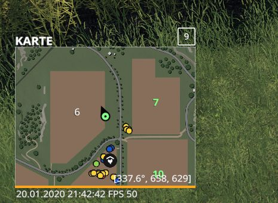

# LS19 Uhrzeit

Zeigt die aktuelle Uhrzeit links unterhalb der InGame-Karte an. Zusätzlich auch noch FPS (frames per second).

Weitere Informationen zum Einbinden der Script-Mods unter [ls19mods](../README.md).
